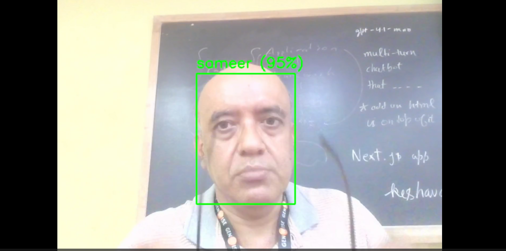

# recognize_face

Upload images to folder face_dataset with the name of the person as folder name and her images in that folder

# check_face

Check face as either unknown or one of the known ones

